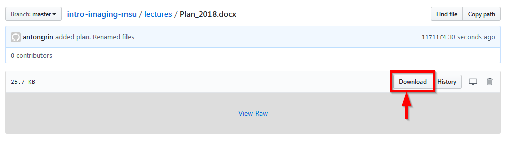

## Лекции

Конспекты. Записи.

### [Программа курса](Plan_2018.docx)
 
- [x] 1. [Введение](Lektsia_01_Vvedenie.docx)
- [x] 2. [Закон Гука, теория упругости](Lektsia_02_Hooke.docx)
- [ ] 3. [Волновое уравнениею Конечно-разностный метод решения волнового уравнения]()
- [x] 4. [Миграция Кирхгофа, часть 1](Lektsia_04_Kirchhoff.docx)
- [ ] 5. [(остутствует)Миграция Кирхгофа, часть 2]()
- [ ] 6. [(остутствует)Построеие глубинно-скоростных моделей]()
- [x] 7. [Сейсмическая анизотропия VTI](Lektsia_06_VTI.docx)
- [ ] 8. [(остутствует)Построение VTI-анизотропных скоростных моделей. Анизотропная глубинаня миграция]()
- [ ] 9. [(остутствует)Beam-миграция]()
- [ ] 10. [(остутствует)Миграция продолжением волновых полей. RTM, WEM]()

Для того, чтобы скачать файл по ссылке, надо на открывшейся странице щелкнуть на кнопку Download

